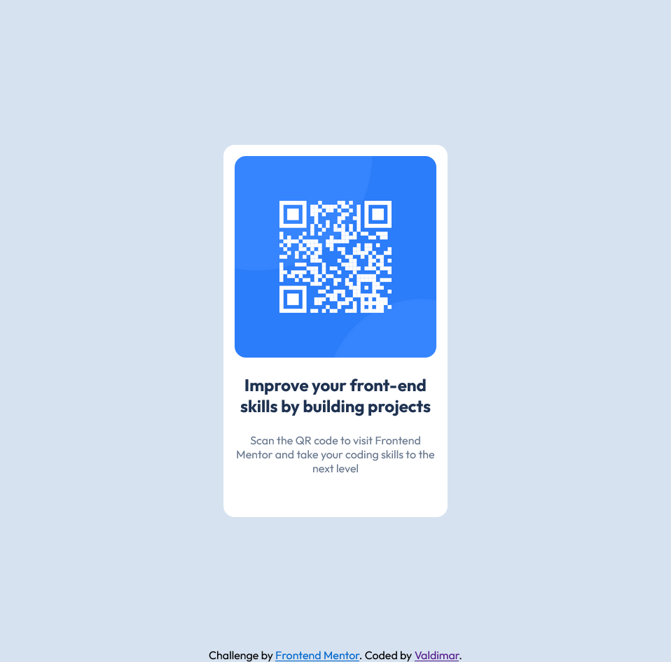

# Frontend Mentor - QR code component solution

This is a solution to the [QR code component challenge on Frontend Mentor](https://www.frontendmentor.io/challenges/qr-code-component-iux_sIO_H). Frontend Mentor challenges help you improve your coding skills by building realistic projects.

## Table of contents

-   [Overview](#overview)
    -   [Screenshot](#screenshot)
    -   [Links](#links)
-   [My process](#my-process)
    -   [Built with](#built-with)
    -   [What I learned](#what-i-learned)
    -   [Continued development](#continued-development)
    -   [Useful resources](#useful-resources)
-   [Author](#author)
-   [Acknowledgments](#acknowledgments)

## Overview

I practiced my component building skills in this exercise.

### Screenshot

Here is a screenshot of my solution


### Built with

-   Semantic HTML5 markup
-   CSS custom properties
-   Flexbox
-   CSS Grid
-   Mobile-first workflow

### What I learned

I learned to use position fixed to fix the attribution to the bottom of the page which I had never done before

```css
.attribution {
	text-align: center;
	position: fixed;
	bottom: 0;
	width: 100%;
}
```

## Author

-   Website - [Add your name here](https://www.your-site.com)
-   Frontend Mentor - [@valdi7913](https://www.frontendmentor.io/profile/valdi7913)
-   Twitter - [@valdi7913](https://www.twitter.com/valdi7913)
